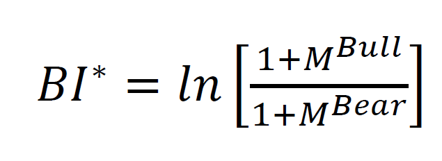
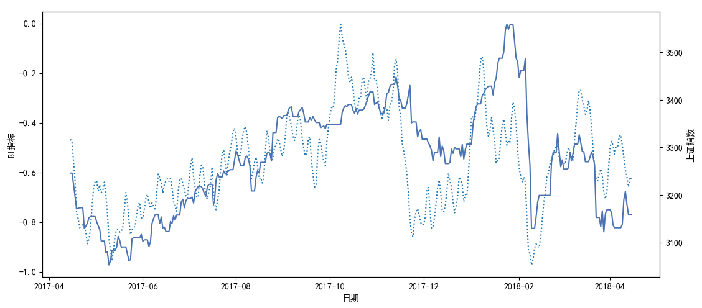

# Stock Market Sentiment Analysis: 股市情感分析

# 情绪与股市
情绪与股市关系的研究由来已久，情绪是市场的一个重要影响因素已成为共识。  
15年股灾时，亲历了一次交易灾难，眼见朋友的数千万在一周不到的时间内灰飞烟灭。那段时间市场的疯狂，让人深刻地明白：某些时候，股票市场这个抽象、复杂的系统，反映的不再是价值与供需，而仅仅是人的贪婪与恐惧。

# 说明  
这份代码是股市情感分析项目的一部分，这个项目的本意是利用互联网提取投资者情绪，为投资决策的制定提供参考。  
在国内这样一个非有效的市场中，分析投资者的情绪似乎更有意义。  
这里我们利用标注语料分析股评情感，利用分析结果构建指标，之后研究指标与股市关系。  
可以按以下顺序运行代码：  
1. python model_ml.py  
2. python compute_sent_idx.py  
3. python plot_sent_idx.py
# 数据 
数据位于data目录下，包括三部分：  
1. 标注的股评文本：这些数据比较偏门，不是很好找，这里搜集整理了正负语料各4607条，已分词。  
2. 从东财股吧抓取的上证指数股评文本：约50万条，时间跨度为17年4月到18年5月。东财上证指数吧十分活跃，约7秒就有人发布一条股评。  
3. 上证指数数据：直接从新浪抓取下来的。
# 模型  
情感分类模型也是文本分类模型，常用的包括机器学习模型与深度学习模型。  
1. model_ml.py：机器学习模型，对比测试了8个模型。  
2. model_dl.py：深度学习模型，对比测试了3个模型。
# 结果 
在经过情感分析、指标构建这两个流程之后，我们可以得到一些有趣的结果，例如看涨情绪与股市走势的关系。  
我们使用的看涨指标公式为：  
    
经过处理之后，“看涨”情绪与股市走势的关系可以描画出来：  
   
这里只展示诸多关系中的一个。
# 总结  
这份代码仅为了演示如何从互联网中提取投资者情绪，并研究情绪与股市的关系。